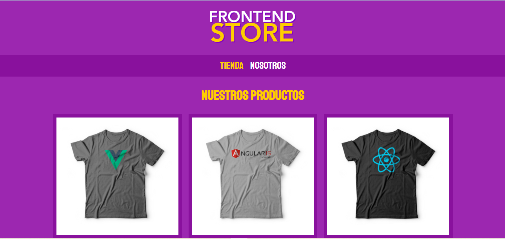

# Proyecto2.frontend_Store (Responsive)
Este es un proyecto donde se desarrolla una tienda virtual de articulos relacionados con el diseño web.

## Autora

[@Alexandra-Santa-Muñoz](https://www.linkedin.com/in/asamu10/)

## Repositorio de Github

Este es el [link](https://github.com/alexa272/Proyecto1.freelancer/tree/main) a el repositorio del proyecto en github

## Sitio web

Aqui puedes ver en vivo mi portafolio [link](https://paginafreelancerasm.netlify.app/)

## Tecnologías

Esta página web fue creada con:

* HTML
* CSS

Además, se incluyeron **Google Fonts** para personalizar la fuente. 

## Curso udemy

Este proyecto correspondiente una tienda virtual de articulos relacionados con el diseño web, segui paso a paso el curso de desarrollo web completo con html5 css3 js php y mysql https://www.udemy.com/course/desarrollo-web-completo-con-html5-css3-js-php-y-mysql/learn/lecture/24122182#overview